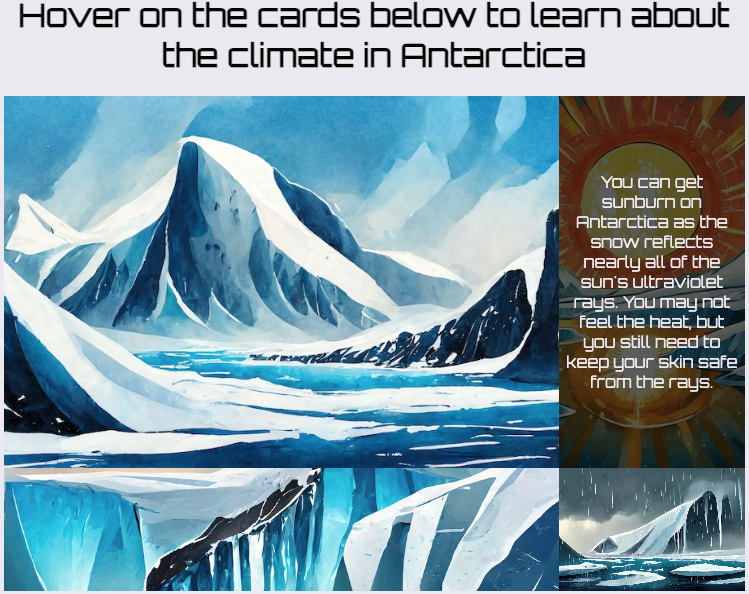

<h2 class="c-project-heading--task">Create a climate grid</h2>

--- task ---

Open `climate.html` and set up the fact cards.

Add the `fact-holder` class attribute to the `
`.

Add a `fact-card` and a background image class to each `` element.

Add the `fact` class attribute to each paragraph.

--- code ---
---
language: html
filename: climate.html
line_numbers: true
line_number_start: 25
line_highlights: 27-46
---
    <main>
      <section>
        <h1>Antarctica's climate</h1>
      </section>
      <section>
        <h1>Hover on the cards below to learn about the climate in Antarctica</h1>
        

          
            

              Antarctica is the coldest continent on Earth. The average temperature in the interior is -57°C, during winter it can reach -90°C.
            

          
          
            

              You can get sunburn on Antarctica as the snow reflects nearly all of the sun's ultraviolet rays. You may not feel the heat, but you still need to keep your skin safe from the rays.
            

          
          
            

              Antarctica's ice sheet is, on average, 1.6km thick and covers about 98% of the continent. This ice sheet is nearly 90% of the entire world’s ice!
            

          
          
            

              Technically, Antarctica is a desert because it is so dry there. The average annual precipitation on the coast is just 166mm.
            

          
        

      </section>
    </main>
  </body>
</html>
    
--- /code ---

--- /task ---

--- task ---

**Test:** Run the Climate page and check you can hover over the cards to reveal the facts.

--- /task ---

