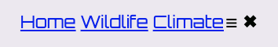

<h2 class="c-project-heading--task">Create a navigation bar</h2>

## Step 1
Open `index.html` and create a navigation bar so visitors can move between pages.

--- code ---
---
language: html
filename: index.html
line_numbers: true
line_number_start: 11
line_highlights: 12-21
---
    <header>
      <nav>
        
 
          <a class="active" href="index.html">Home</a>
          <a href="wildlife.html">Wildlife</a>
          <a href="climate.html">Climate</a>
        

        

          &#9776;
          &#x2716;
        

      </nav>
    </header>
--- /code ---

## Step 2

Open `wildlife.html` and `climate.html` and add the same code.

## Step 3

Add `class="active"` to the link for the file you are editing.

## Now run your code
Click the navbar links, and check that you can open **Home**, **Wildlife**, and **Climate**.

