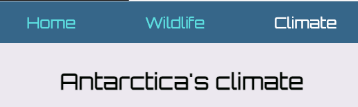

<h2 class="c-project-heading--task">Style the navigation bar</h2>

Use CSS to turn your links into a clear navigation bar.

--- task ---

Open `style.css` and find the `/* Nav bar */` comment.

Add the navbar styles underneath that comment.

--- code ---
---
language: css
filename: style.css
line_numbers: true
line_number_start: 37
line_highlights: 45, 50-53, 56-60, 63-65, 68-71, 74-80
---
/* Nav bar */
nav {
  padding: 0 15px;
  height: 60px;
  font-size: 22px;
  display: flex;
  justify-content: center;
  align-items: center;
  background-color: var(--nav-colour);
}

/* Nav items */
.nav-items {
  display: flex;
  gap: 100px;
}

/* Nav bar links */
.nav-items > a {
  color: var(--nav-items-colour);
  text-decoration: none;
  transition: 0.4s ease-in-out;
}

/* Nav links hover */
.nav-items > a:hover {
  color: var(--nav-items-active);
}

/* Nav links active */
.nav-items .active {
  color: var(--nav-items-active);
  pointer-events: none;
}

/* Burger menu */
.burger {
  display: none;
  font-size: 20px;
  font-weight: 800;
  color: var(--burger-colour);
  margin-left: auto;
}
--- /code ---

--- /task ---

--- task ---

**Test:** Run your project again and check the navbar is styled and the current page link now looks “active”.

--- /task ---

