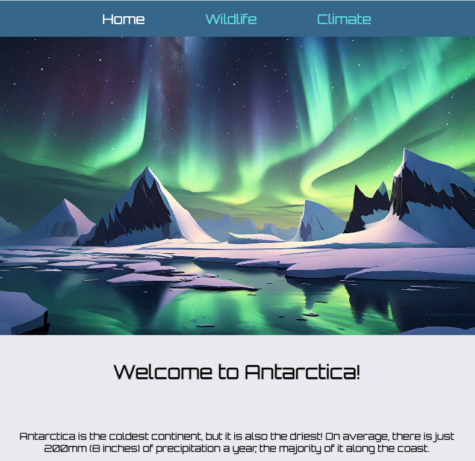

<h2 class="c-project-heading--task">Add hero images</h2>

Add a big **hero image** at the top of a page to show what it’s about.

## Step 1

In `index.html`, add a hero image `
` underneath the header.

--- code ---
---
language: html
filename: index.html
line_numbers: true
line_number_start: 23
line_highlights: 24
---
    </header>
    

    <main>
--- /code ---

## Step 2

In `style.css`, find the `/* Hero image - homepage */` comment and add the `hero-image` code underneath it.

--- code ---
---
language: css
filename: style.css
line_numbers: true
line_number_start: 81
line_highlights: 72-87
---
/* Hero image - homepage */
.hero-image {
  min-height: 50vh; /* 50% of the visible area of the page */
  background-image: url('antarctic-lights.jpg'); 
  background-size: cover;
  background-position: center;
}
--- /code ---

## Now run your code
Check that a large image appears near the top of the homepage.

> ### Tip
> 
> Instead of adding an `` element to the HTML, this uses the CSS `background-image` property to add your image.
{: .c-project-callout .c-project-callout--tip}

