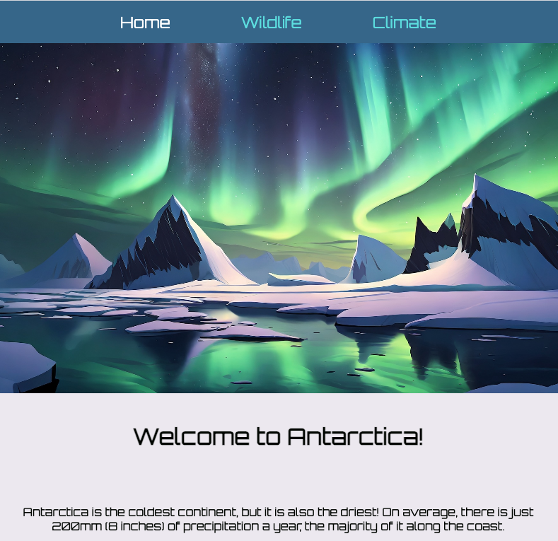

<h2 class="c-project-heading--task">Add hero images</h2>

Add a big 'hero image' at the top of a page to show what it’s about.

--- task ---

Open `index.html` and add a hero image `
` underneath the header on the homepage.

--- code ---
---
language: html
filename: index.html
line_numbers: true
line_number_start: 23
line_highlights: 24
---
    </header>
    

    <main>
--- /code ---

--- /task ---

--- task ---

In `style.css`, find the `/* Hero image - homepage */` comment and add a new selector for the `hero-image` class underneath it.

Instead of adding an `` element to the HTML, you can use the CSS `background-image` property to add your image. 

--- code ---
---
language: css
filename: style.css
line_numbers: true
line_number_start: 82
line_highlights: 83-88
---

/* Hero image - homepage */
.hero-image {
  min-height: 50vh; /* 50% of the visible area of the page */
  background-image: url('antarctic-lights.jpg'); 
  background-size: cover;
  background-position: center;
}

--- /code ---

--- /task ---

--- task ---

**Test:** Check a large image appears near the top of the homepage.

--- /task ---

