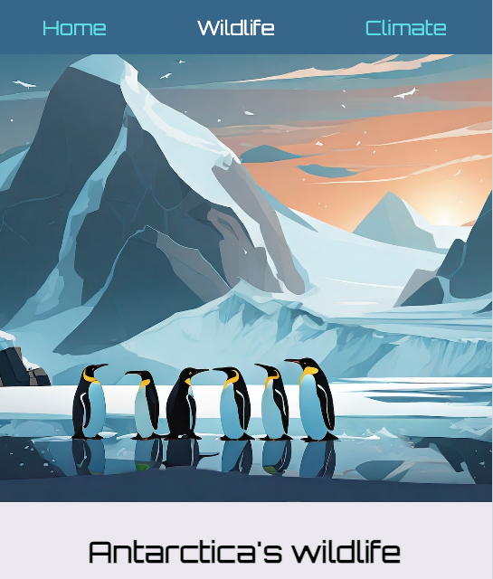

<h2 class="c-project-heading--task">Different hero images</h2>

Each page should have its own hero image that represents its content!

## Step 1

In `style.css`, find the `/* Hero image - wildlife */` comment and the code underneath it.

--- code ---
---
language: css
filename: style.css
line_numbers: true
line_number_start: 90
line_highlights: 91-93
---
/* Hero image - wildlife */
.wildlife {
  background-image: url('antarctic-penguins.jpg');
}
--- /code ---

## Step 2

In **wildlife.html** add the `hero-image` class.

--- code ---
---
language: html
filename: wildlife.html
line_numbers: true
line_number_start: 23
line_highlights: 24
---
    </header>
    

    <main>
--- /code ---

## Step 3

In **style.css**, find the `/* Hero image - climate */` comment and add the following code underneath it.

--- code ---
---
language: css
filename: style.css
line_numbers: true
line_number_start: 95
line_highlights: 96-98
---
/* Hero image - climate */
.climate {
  background-image: url('antarctic-daytime.jpg');
}
--- /code ---

## Step 4

In **climate.html**, add the new `climate` class.

--- code ---
---
language: html
filename: climate.html
line_numbers: true
line_number_start: 22
line_highlights: 23
---
  </header>
  

  <main>
--- /code ---

## Now run your code
Check that a large image appears near the top of each page.

