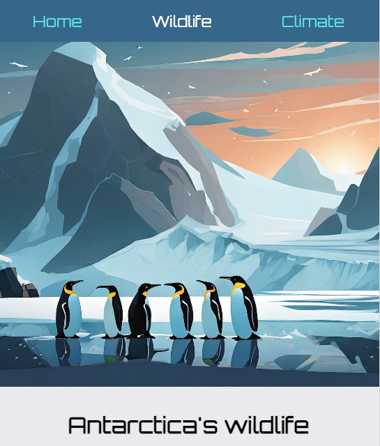

<h2 class="c-project-heading--task">Different hero images</h2>

Each page should have its own hero image that represents its content!

--- task ---

Inside `style.css`, find the `/* Hero image - wildlife */` comment and add a new class selector for wildlife underneath it.

You can set a new `background-image` property, which will overwrite the one set in the `hero-image` class.

--- code ---
---
language: css
filename: style.css
line_numbers: true
line_number_start: 90
line_highlights: 91-93
---
/* Hero image - wildlife */
.wildlife {
  background-image: url('antarctic-penguins.jpg');
}

--- /code ---

--- /task ---

--- task ---

Apply the new `wildlife` class as an **addition** to the `hero-image` class in `wildlife.html`.

--- code ---
---
language: html
filename: wildlife.html
line_numbers: true
line_number_start: 23
line_highlights: 25
---
    </header>
    

    <main>

--- /code ---

--- /task ---

--- task ---

Find the `/* Hero image - climate */` comment and add a new class selector for climate underneath it.

--- code ---
---
language: css
filename: style.css
line_numbers: true
line_number_start: 95
line_highlights: 96-98
---
/* Hero image - climate */
.climate {
  background-image: url('antarctic-daytime.jpg');
}

--- /code ---

--- /task ---

--- task ---

Now apply the new `climate` class as an **addition** to the `hero-image` class in `climate.html`.

--- code ---
---
language: html
filename: climate.html
line_numbers: true
line_number_start: 22
line_highlights: 24
---

  </header>
  

  <main>

--- /code ---

--- /task ---

--- task ---

**Test:** Check a large image appears near the top of each page.

--- /task ---

