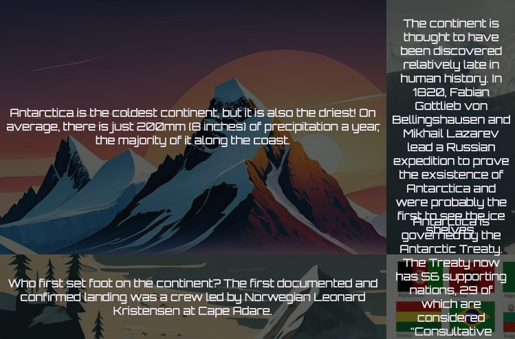

<h2 class="c-project-heading--task">Arrange facts with grids</h2>

Turn your facts into image cards arranged in a grid.

--- task ---

Open `index.html` and update the first `<section>`.

Keep the existing `Welcome to Antarctica!` heading, then add the second heading and the `fact-holder` `
` inside the same section.

--- code ---
---
language: html
filename: index.html
line_numbers: true
line_number_start: 25
line_highlights: 28-50
---
    <main>
      <section>
        <h1>Welcome to Antarctica!</h1>
        <h1>Hover on the cards below to read some facts about Antarctica</h1>
        

          
            

              Antarctica is the coldest continent, but it is also the driest! On average, there is just 200mm (8 inches) of precipitation a year, the majority of it along the coast.
            

          
          
            

              The continent is thought to have been discovered relatively late in human history. In 1820, Fabian Gottlieb von Bellingshausen and Mikhail Lazarev lead a Russian expedition to prove the exsistence of Antarctica and were probably the first to see the ice shelves. 
            

          
          
            

              Who first set foot on the continent? The first documented and confirmed landing was a crew led by Norwegian Leonard Kristensen at Cape Adare.
            

          
          
            

              Antarctica is governed by the Antarctic Treaty. The Treaty now has 56 supporting nations, 29 of which are considered “Consultative Parties” and are actively involved in decision-making.
            

          
        

      </section>
    </main>
--- /code ---

--- /task ---

--- task ---

Open `style.css` and find the `/* Fact card */` comment.

Add this CSS so each fact card fills its grid area and shows its background image properly.

--- code ---
---
language: css
filename: style.css
line_numbers: true
line_number_start: 111
line_highlights: 112-117
---
/* Fact card */
.fact-card {
  width: 100%;
  display: flex;
  background-size: cover;
  background-position: center;
}
--- /code ---

--- /task ---

--- task ---

**Test:** Run your homepage code and check that you can see four fact cards arranged in a grid.

--- /task ---

