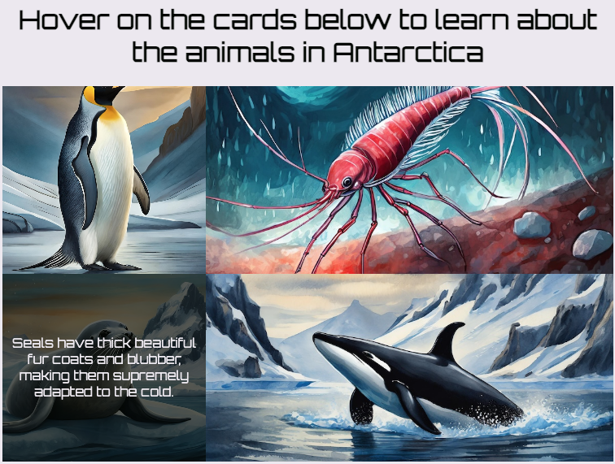

## Create a wildlife grid

Use a different grid layout to show wildlife facts in a new way.

## Step 1

In **wildlife.html**, set up the wildlife fact cards.

```html filename="wildlife.html" line_numbers="true" line_number_start="24" line_highlights="27-48"
    <div class="hero-image wildlife"></div>
    <main>
      <section>
        <h1>
          Hover on the cards below to learn about the animals in Antarctica
        </h1>
        <div class="fact-holder-wildlife">
          <span class="fact-card penguins">
            <p class="fact">
              Emperor penguins live in colonies on sea ice. Sea ice is frozen sea water and it forms a fringe around the Antarctic continent.
            </p>
          </span>
          <span class="fact-card krill">
            <p class="fact">
              Krill is eaten by many organisms, such as penguins, birds, and even the ginormous elephant seal!
            </p>
          </span>
          <span class="fact-card seals">
            <p class="fact">
              Seals have thick beautiful fur coats and blubber, making them supremely adapted to the cold.
            </p>
          </span>
          <span class="fact-card orcas">
            <p class="fact">
              At the top of the food chain, there are Orcas, often known as Killer Whales. These are the biggest carnivores on Earth, reaching almost 10m in length!
            </p>
          </span>
        </div>
      </section>
    </main>
          
```

## Step 2

In `style.css`, add the `fact-holder-wildlife` code.

```css filename="style.css" line_numbers="true" line_number_start="108" line_highlights="109-114"
/* Fact holder - wildlife */
.fact-holder-wildlife {
  display: grid;
  height: 70vh;
  grid-template-rows: 1fr 1fr 1fr;
  grid-template-columns: 1fr 2fr;
}
```

## Now run your code
Check that you can hover over the cards to reveal the facts on the wildlife page.


